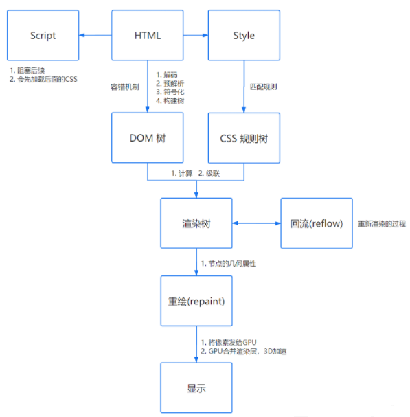

# 20240117面试

## 说说js的事件循环

JavaScript代码的执行过程中，除了依靠函数调用栈来搞定函数的执行顺序外，还依靠任务队列(task queue)来搞定另外一些代码的执行。整个执行过程，我们称为事件循环过程。

一个线程中，事件循环是唯一的，但是任务队列可以拥有多个。任务队列又分为macro-task（宏任务）与micro-task（微任务）

#### macro-task大概包括：

- script(整体代码)
- setTimeout
- setInterval
- setImmediate
- I/O
- UI render


#### micro-task大概包括:

- process.nextTick
- Promise
- Async/Await(实际就是promise)
- MutationObserver(html5新特性)

```html
<!DOCTYPE html>
<html lang="en">
    <head>
        <meta charset="UTF-8" />
        <meta name="viewport" content="width=device-width, initial-scale=1.0" />
        <title>Document</title>
    </head>
    <body>
        <script>
            console.log("script start");

            async function async1() {
                await async2();
                console.log("async1 end");
            }
            async function async2() {
                console.log("async2 end");
            }
            async1();

            setTimeout(function() {
                console.log("setTimeout");
            }, 0);

            new Promise((resolve) => {
                console.log("Promise");
                resolve();
            })
                .then(function() {
                    console.log("promise1");
                })
                .then(function() {
                    console.log("promise2");
                });

            console.log("script end");

            /**
             script start
             async2 end
            Promise
            script end
            async1 end
            promise1
            promise2
            setTimeout
             */
        </script>
    </body>
</html>

```

# 说说输入url到浏览器发生了什么？

- URL解析
- DNS 查询
- TCP 连接
- HTTP 请求
- 响应请求
- 页面渲染

### 响应请求

当服务器接收到浏览器的请求之后，就会进行逻辑操作，处理完成之后返回一个HTTP响应消息，包括：

- 状态行

- 响应头

- 响应正文

### 渲染页面

关于页面的渲染过程如下：

- 解析HTML，构建 DOM 树

- 解析 CSS ，生成 CSS 规则树

- 合并 DOM 树和 CSS 规则，生成 render 树

- 布局 render 树（ Layout / reflow ），负责各元素尺寸、位置的计算

- 绘制 render 树（ paint ），绘制页面像素信息

- 浏览器会将各层的信息发送给 GPU，GPU 会将各层合成（ composite ），显示在屏幕上

#### 回流(reflow)
当浏览器发现某个部分发现变化影响了布局时，需要倒回去重新渲染，会从html标签开始递归往下，重新计算位置和大小。

reflow基本是无法避免的，因为当你滑动一下鼠标、resize 窗口，页面就会产生变化。

#### 重绘(repaint)

改变了某个元素的背景色、文字颜色等等不会影响周围元素的位置变化时，就会发生重绘。

每次重绘后，浏览器还需要合并渲染层并输出到屏幕上。

回流的成本要比重绘高很多，所以我们应该尽量避免产生回流。

比如：

display:none 会触发回流，而 visibility:hidden 只会触发重绘。

<p>

</p>

## 说说compiler和compilation

Compiler 是webpack的主要引擎，可以创建一个compilation。Compiler他是继承Tapable类，是为了注册和调用插件。大多数面向用户的插件会首先在Compiler上注册。

Compilation 模块会被 Compiler 用来创建新的 compilation 对象（或新的 build 对象）。 compilation 实例能够访问所有的模块和它们的依赖（大部分是循环依赖）。 它会对应用程序的依赖图中所有模块， 进行字面上的编译(literal compilation)。 在编译阶段，模块会被加载(load)、封存(seal)、优化(optimize)、 分块(chunk)、哈希(hash)和重新创建(restore)。


## 说说webpack 是如何tree Shaking的

Tree-Shaking 运行过程中静态分析模块之间的导入导出，确定 ESM 模块中哪些导出值未曾其它模块使用，并将其删除，以此实现打包产物的优化。


## 说说你知道的算法

 排序算法：冒泡排序，二分法排序
 加密算法：哈希函数

## 说说tcp为什么要三次握手，四次挥手

 三次握手：是为了确定双发都有收发数据的能力，为后面的可靠性传输做准备。

 ```
第一次握手（客户端发送 SYN 报文给服务器，服务器接收该报文）：
客户端什么都不能确认；服务器确认了对方发送正常，自己接收正常

第二次握手（服务器响应 SYN 报文给客户端，客户端接收该报文）：
客户端确认了：自己发送、接收正常，对方发送、接收正常；服务器确认了：对方发送正常，自己接收正常

第三次握手（客户端发送 ACK 报文给服务器）：
客户端确认了：自己发送、接收正常，对方发送、接收正常； 
服务器确认了：自己发送、接收正常，对方发送、接收正常
 ```

 四次挥手：由于 TCP 的半关闭（half-close）特性，TCP 提供了连接的一端在结束它的发送后还能接收来自另一端数据的能力。

 任何一方都可以在数据传送结束后发出连接释放的通知，待对方确认后进入半关闭状态。当另一方也没有数据再发送的时候，则发出连接释放通知，对方确认后就完全关闭了TCP连接。

 https://zhuanlan.zhihu.com/p/496244348