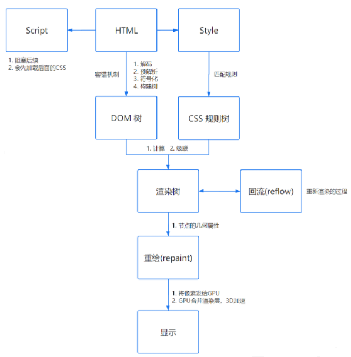

# 说说js的事件循环

JavaScript代码的执行过程中，除了依靠函数调用栈来搞定函数的执行顺序外，还依靠任务队列(task queue)来搞定另外一些代码的执行。整个执行过程，我们称为事件循环过程。

一个线程中，事件循环是唯一的，但是任务队列可以拥有多个。任务队列又分为macro-task（宏任务）与micro-task（微任务）

macro-task大概包括：

- script(整体代码)
- setTimeout
- setInterval
- setImmediate
- I/O
- UI render

micro-task大概包括:

- process.nextTick
- Promise
- Async/Await(实际就是promise)
- MutationObserver(html5新特性)

# 说说输入url到浏览器发生了什么？

- URL解析
- DNS 查询
- TCP 连接
- HTTP 请求
- 响应请求
- 页面渲染

### 响应请求

当服务器接收到浏览器的请求之后，就会进行逻辑操作，处理完成之后返回一个HTTP响应消息，包括：

- 状态行

- 响应头

- 响应正文

### 渲染页面

关于页面的渲染过程如下：

- 解析HTML，构建 DOM 树

- 解析 CSS ，生成 CSS 规则树

- 合并 DOM 树和 CSS 规则，生成 render 树

- 布局 render 树（ Layout / reflow ），负责各元素尺寸、位置的计算

- 绘制 render 树（ paint ），绘制页面像素信息

- 浏览器会将各层的信息发送给 GPU，GPU 会将各层合成（ composite ），显示在屏幕上

