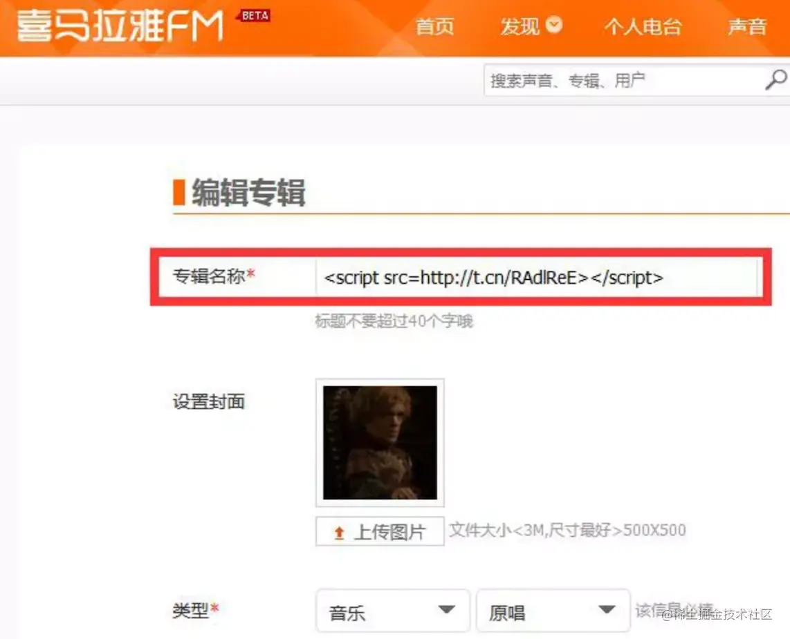
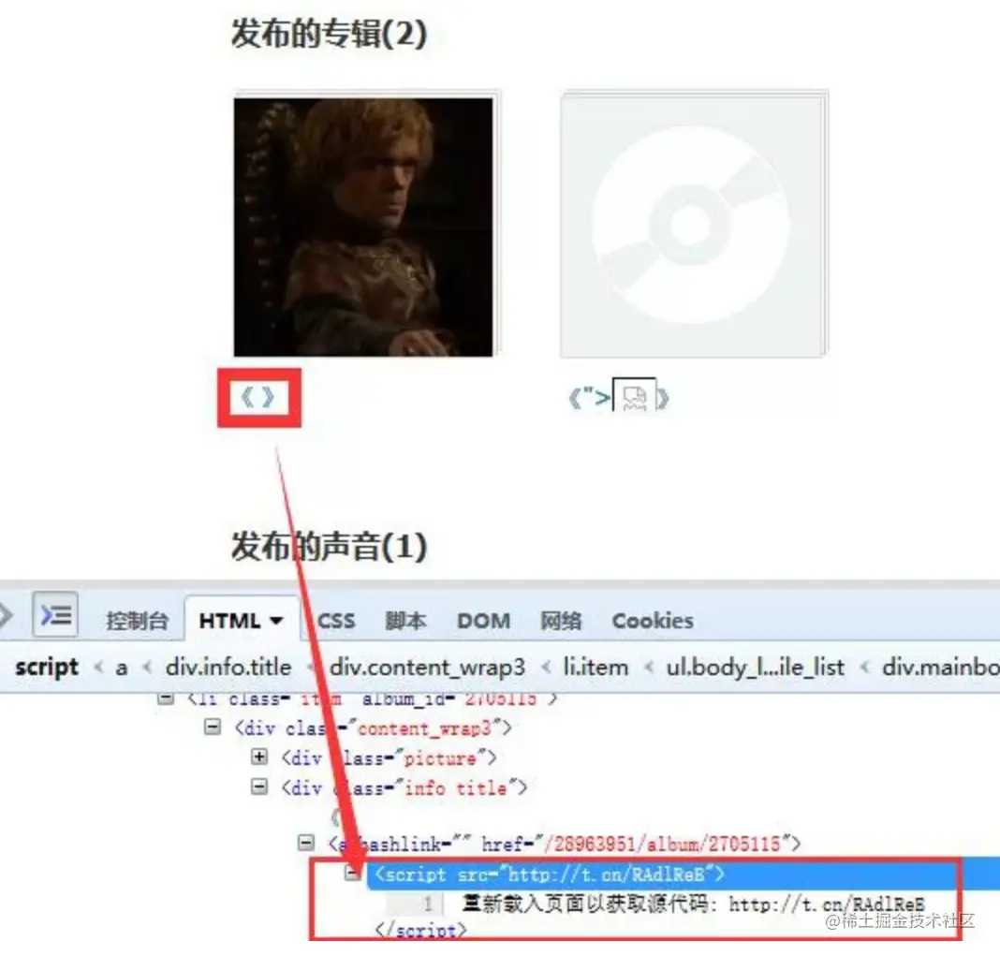
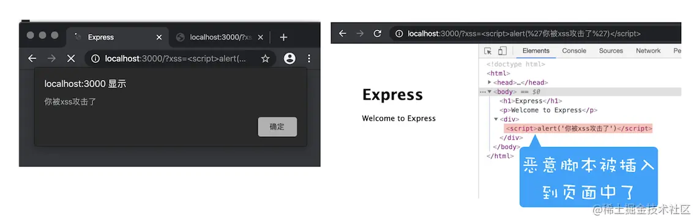

# web安全问题

> 在 Web 安全领域中，XSS 和 CSRF 是最常见的攻击方式。

- XSS攻击： 跨站脚本攻击。即 Cross Site Script

  `攻击者脚本` 嵌入 `被攻击网站`，获取用户cookie等隐私信息。

- CSRF攻击： 跨站请求伪造。即 Cross-site request forgery

 `已登录用户` 访问 `攻击者网站`，攻击网站向被攻击网站发起恶意请求（利用浏览器会自动携带cookie）。

## 1.XSS攻击与防御

### 存储型

存储型 XSS 会把用户输入的数据 "存储" 在服务器端，当浏览器请求数据时，脚本从服务器上传回并执行。这种 XSS 攻击具有很强的稳定性。

下面我们来看个例子，2015 年喜马拉雅就被曝出了存储型 XSS 漏洞。起因是在用户设置专辑名称时，服务器对关键字过滤不严格，比如可以将专辑名称设置为一段 JavaScript，如下图所示：

<p>
 
</p>

当黑客将专辑名称设置为一段 JavaScript 代码并提交时，喜马拉雅的服务器会保存该段 JavaScript 代码到数据库中。然后当用户打开黑客设置的专辑时，这段代码就会在用户的页面里执行（如下图），这样就可以获取用户的 Cookie 等数据信息。

<p>

</p>

### 反射型
反射型 XSS 只是简单地把用户输入的数据 “反射” 给浏览器，这种攻击方式往往需要攻击者诱使用户点击一个恶意链接，或者提交一个表单，或者进入一个恶意网站时，注入脚本进入被攻击者的网站。

下面我们结合一个简单的 Node 服务程序来看看什么是反射型 XSS。首先我们使用 Node 来搭建一个简单的页面环境，搭建好的服务代码如下所示：

```js
var express = require('express');
var router = express.Router();
 
 
/* GET home page. */
router.get('/', function(req, res, next) {
  res.render('index', { title: 'Express',xss:req.query.xss });
});
 
 
module.exports = router;

```

```js
<!DOCTYPE html>
<html>
<head>
  <title><%= title %></title>
  <link rel='stylesheet' href='/stylesheets/style.css' />
</head>
<body>
  <h1><%= title %></h1>
  <p>Welcome to <%= title %></p>
  <div>
      <%- xss %>
  </div>
</body>
</html>
```

但当打开http://localhost:3000/?xss=alert('你被xss攻击了')这段 URL 时，其结果如下图所示：

<p>
     
</p>

### 防御

- 1.服务器对输入脚本进行过滤或转码

- 2.充分利用 CSP

- 3.使用 HttpOnly 属性

```
set-cookie: NID=189=M8q2FtWbsR8RlcldPVt7qkrqR38LmFY9jUxkKo34Bi6Qu_ocNOat7nkYZUTzolHjFnwBw0izgsATSI7TZyiiiaV94qGh-BzEYsNVa7TZmjAYTxYTOM9L_-0CN9ipL6cXi8l6-z41asXtm2uEwcOC5oh9djkffOMhWqQrlnCtOI; expires=Sat, 18-Apr-2020 06:52:22 GMT; path=/; domain=.google.com; HttpOnly

```

  我们可以看到，set-cookie 属性值最后使用了 HttpOnly 来标记该 Cookie。顾名思义，使用 HttpOnly 标记的 Cookie 只能使用在 HTTP 请求过程中，所以无法通过 JavaScript 来读取这段 Cookie。我们还可以通过 Chrome 开发者工具来查看哪些 Cookie 被标记了 HttpOnly，如下图：

## 2.CSRF攻击与防御
 
### 1. 自动发起Get请求

黑客最容易实施的攻击方式是自动发起 Get 请求,具体攻击方式你可以参考下面这段代码:

```html
<! DOCTYPE html> 
<html>
  <body>
    <h1>黑客的站点: CSRF攻击演示</h1>
	 
  </body>
</html>
```

这是黑客页面的 HTML 代码，在这段代码中，黑客将转账的请求接口隐藏在 img 标签内，欺骗浏览器这是一张图片资源。当该页面被加载时，浏览器会自动发起 img 的资源请求，如果服务器没有对该请求做判断的话，那么服务器就会认为该请求是一个转账请求，于是用户账户上的100极客币就被转移到黑客的账户上去了。

### 2.自动发起POST请求

```html
<!DOCTYPE html>
<html>
  <body>
	<h1>黑客的站点: CSRF攻击演示</h1>
	<form id= 'hacker-form' action="https://time.geekbang.org/sendcoin" method=POST>
	  <input type="hidden" name="userll" value="hacker" />
	  <input type="hidden" name="numberll" value="100" />
	</form>
	<script> document.getElementById ('hacker-form').submit(); </script> 
  </body>
</html>
```

在这段代码中,我们可以看到黑客在他的页面中构建了一个隐藏的表单，该表单的内容就是极客时间的转账接口。当用户打开该站点之后,这个表单会被自动执行提交；当表单被提交之后，服务器就会执行转账操作。因此使用构建自动提交表单这种方式，就可以自动实现跨站点POST数据提交。


### 防御

- 1. 充分利用好Cookie的SameSite属性

  在 HTTP 响应头中，通过 set-cookie 字段设置 Cookie 时，可以带上 SameSite 选项，如下：
  ```
    Set-Cookie: widget_session=abc123; SameSite=None; Secure
  ```

- 2. 验证请求的来源站点

   这就需要介绍 HTTP 请求头中的 Referer 和 Origin 属性了。

- 3. CSRF Token

   第一步，在浏览器向服务器发起请求时，服务器生成一个 CSRF Token，CSRF Token 其实就是服务器生成的字符串，然后将该字符串植入到返回的页面中。你可以参考下面示例代码:

```html
<! DOCTYPE html>
<html>
  <body>
    <form action="https://time.geekbang.org/sendcoin" method="POST">
      <input type="hidden"" name=lcsrf-token"" value="nc98P987bcpncYhoadjoiydc9ajDl <input type="text"l name="userll>
      <input type="text" name="number"l>
      <input type="submit">
    </form>
  </body>
</html>
```

第二步，在浏览器端如果要发起转账的请求，那么需要带上页面中的 CSRF Token，然后服务器会验证该 Token 是否合法。如果是从第三方站点发出的请求，那么将无法获取到 CSRF Token 的值，所以即使发出了请求，服务器也会因为 CSRF Token 不正确而拒绝请求。


文章：https://juejin.cn/post/6945277278347591688#heading-0